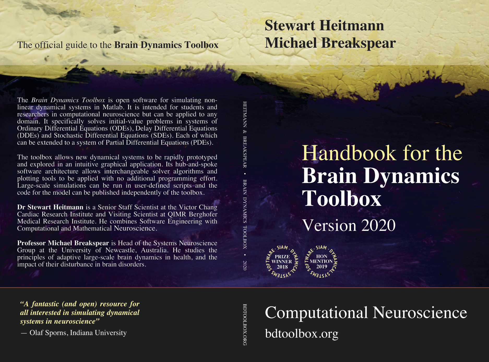

# Brain Dynamics Toolbox
## Version 2021a

Open software for simulating non-linear dynamical systems in Matlab.

## Download
The source code and training materials are available from [https://bdtoolbox.org](http://bdtoolbox.org).

## BSD License
This software is distributed under the [2-clause BSD license](https://opensource.org/licenses/BSD-2-Clause).